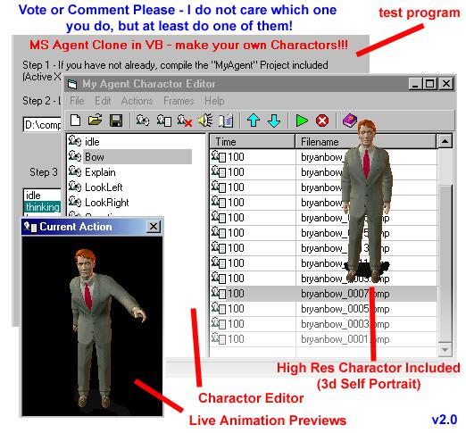



## MS Agent Clone Version 2 \(A MUST SEE\)

### Description

This is an MS Agent Character Clone version 2.0! Same features as 1.0 - but with a bunch more options (see readme.txt in zip file)
 
### More Info
 
Do not put frame durations under 50 milliseconds on slow systems!!!

             |
---                |---
**Submitted On**   |2002-03-12 02:06:32
**By**             |[Bryan A\. Cairns](https://github.com/Planet-Source-Code/PSCIndex/blob/master/ByAuthor/bryan-a-cairns.md)
**Level**          |Intermediate
**User Rating**    |4.9 (98 globes from 20 users)
**Compatibility**  |VB 5\.0, VB 6\.0
**Category**       |[Complete Applications](https://github.com/Planet-Source-Code/PSCIndex/blob/master/ByCategory/complete-applications__1-27.md)
**World**          |[Visual Basic](https://github.com/Planet-Source-Code/PSCIndex/blob/master/ByWorld/visual-basic.md)
**Archive File**   |[MS\_Agent\_C614993122002\.zip](https://github.com/Planet-Source-Code/bryan-a-cairns-ms-agent-clone-version-2-a-must-see__1-32608/archive/master.zip)

